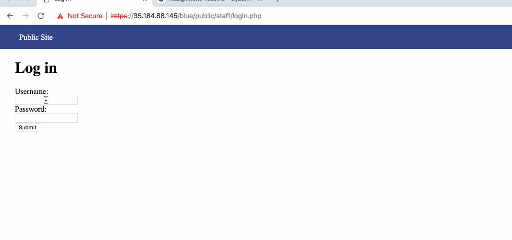

# Week8-WebSecurity

# Project 8 - Pentesting Live Targets

Time spent: **10** hours spent in total

> Objective: Identify vulnerabilities in three different versions of the Globitek website: blue, green, and red.

The six possible exploits are:
* Username Enumeration
* Insecure Direct Object Reference (IDOR)
* SQL Injection (SQLi)
* Cross-Site Scripting (XSS)
* Cross-Site Request Forgery (CSRF)
* Session Hijacking/Fixation

Each version of the site has been given two of the six vulnerabilities. (In other words, all six of the exploits should be assignable to one of the sites.)

## Blue

Vulnerability #1: SQL injection

- Description: Test the blue section will show "Database query failded", and others will redirect the page.
The test I used is '''?id=' OR 1=1'--'''


Vulnerability #2: Session Hijacking/Fixation

- Description: Login to he blue section, change it to ```public/hacktools/change_session_id.php``` to get
the session ID. Then open another brower to change the session ID. You will automatically login



## Green

Vulnerability #1: Username Enumeration

- Description: when you test the correct username, the inspect page will show "failture". when you test the wrong username,
it will show "failed".


Vulnerability #2: Cross-Site Scripting

- Description: In the contact page, enter your name and feedback. For example '''<script>alert('Xingcheng found the XSS!')</script>'''
then go to the feedback. The alert will appear.


## Red

Vulnerability #1: Insecure Direct Object Reference (IDOR)

- Description: You will find the salepersons who are not in the list. I changed the id = 9, 10, 11 to testify.


Vulnerability #2: Cross-Site Request Forgery (CSRF)

- Description: When I try to change the username in the edit section. I change the value of csrd_token. Only the red section works.


## Bonus Objective 2: Build on Objective #4 (Cross-Site Scripting)

- Descrption: In the green feedback section, I used ```<script>document.location="https://www.google.com"</script>``` 
and when I click feedback it will direct to google page.


## Notes

Describe any challenges encountered while doing the work
